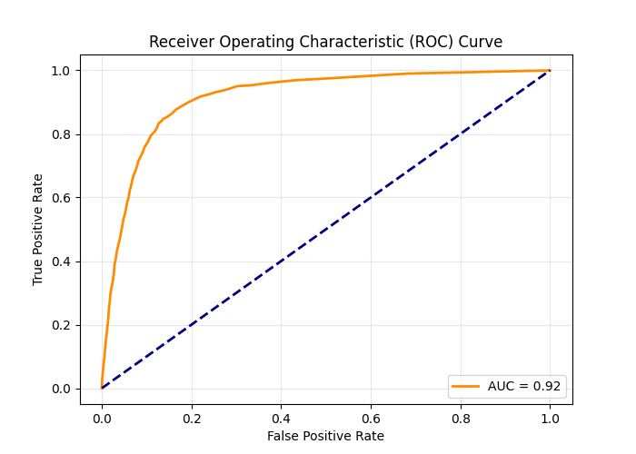

# 🏦 Bank Term Subscription Prediction using Random Forest

A Machine Learning case study that predicts whether a customer will subscribe to a bank term deposit using the **Random Forest Classification Algorithm**.

The project performs data preprocessing, feature engineering, model training, evaluation, and prediction while saving the trained model and scaler for future use.

---

## 📌 Project Overview

This project demonstrates a complete supervised Machine Learning pipeline for predicting customer term deposit subscriptions.

The application performs the following tasks:

- Load the bank marketing dataset
- Perform Exploratory Data Analysis (EDA)
- Clean and preprocess the dataset
- Handle missing values and outliers
- Apply Label Encoding and One-Hot Encoding
- Scale numerical features
- Split the dataset into training and testing sets
- Train a Random Forest Classifier
- Evaluate model performance
- Plot Confusion Matrix and ROC Curve
- Save the trained model and scaler
- Export prediction results to a CSV file

---

## 📂 Project Structure

```text
BANK TERM SUBSCRIPTION CASE STUDY
│
├── BankTermPredictionRandomForest.py
├── bank-full.csv
├── bank-full_Output.csv
├── bank_rf_model.joblib
├── bank_scaler.joblib
├── AUC.png
├── README.md
└── requirements.txt
```

---

## 🛠 Technologies Used

- Python 3.x
- Pandas
- NumPy
- Matplotlib
- Seaborn
- Scikit-learn
- Joblib

---

## 📦 Required Libraries

Install all required libraries using:

```bash
pip install -r requirements.txt
```

or

```bash
pip install pandas numpy matplotlib seaborn scikit-learn joblib
```

---

## ▶️ How to Run

Clone the repository

```bash
git clone https://github.com/yogikh2005/ML_Case_Study.git
```

Go to the project folder

```bash
cd ML_Case_Study
```

Run the application

```bash
python BankTermPredictionRandomForest.py
```

---

## 📊 Dataset

Dataset used:

**bank-full.csv**

The dataset contains customer information collected from direct marketing campaigns conducted by a banking institution.

---

## 📄 Dataset Features

Some important features include:

| Feature | Description |
|----------|-------------|
| age | Customer Age |
| job | Occupation |
| marital | Marital Status |
| education | Education Level |
| default | Credit Default Status |
| balance | Average Yearly Balance |
| housing | Housing Loan |
| loan | Personal Loan |
| month | Last Contact Month |
| campaign | Number of Contacts |
| previous | Previous Contacts |
| y | Target Variable |

---

## 🎯 Target Variable

| Value | Meaning |
|--------|---------|
| 0 | No Subscription |
| 1 | Subscription |

---

## ⚙️ Data Preprocessing

The preprocessing pipeline includes:

- Removing unnecessary columns
- Label Encoding
- One-Hot Encoding
- Missing Value Handling
- Outlier Detection using IQR
- Median Imputation
- Feature Scaling using StandardScaler

---

## ⚙️ Machine Learning Workflow

1. Load Dataset
2. Perform Dataset Analysis
3. Data Cleaning
4. Handle Missing Values
5. Handle Outliers
6. Encode Categorical Features
7. Split Dataset
8. Scale Features
9. Train Random Forest Model
10. Predict Customer Subscription
11. Evaluate Model
12. Plot Confusion Matrix
13. Plot ROC Curve
14. Save Model
15. Save Scaler
16. Export Predictions to CSV

---

## 🤖 Model Details

### Algorithm

- Random Forest Classifier

### Model Parameters

```python
RandomForestClassifier(
    n_estimators=100,
    random_state=42
)
```

### Feature Scaling

```python
StandardScaler()
```

---

## 📈 Model Evaluation

The model is evaluated using:

- Accuracy Score
- ROC-AUC Score
- Classification Report
- Confusion Matrix
- ROC Curve

---

## 📷 ROC Curve

The ROC Curve generated after model evaluation is shown below.

<p align="center">
  
</p>

---

## 💾 Output Files

### Trained Model

```text
bank_rf_model.joblib
```

### Saved Scaler

```text
bank_scaler.joblib
```

### Prediction Output

```text
bank-full_Output.csv
```

---

## 📁 Generated Files

After successful execution, the following files are generated:

- bank-full_Output.csv
- bank_rf_model.joblib
- bank_scaler.joblib

---

## 📚 Concepts Covered

- Supervised Machine Learning
- Random Forest Classification
- Feature Engineering
- Label Encoding
- One-Hot Encoding
- Missing Value Imputation
- Outlier Treatment (IQR Method)
- StandardScaler
- Model Evaluation
- ROC Curve
- AUC Score
- Confusion Matrix
- Joblib Model Persistence

---

## 🚀 Future Improvements

- Hyperparameter Tuning using GridSearchCV
- Feature Importance Visualization
- Cross Validation
- XGBoost Classifier
- LightGBM
- CatBoost
- Flask REST API
- Streamlit Web Application

---

## 👨‍💻 Author

**Yogiraj Khaladkar**

Engineering Student | Machine Learning Developer


---

## ⭐ Repository

If you found this project useful, please consider giving it a ⭐ on GitHub.