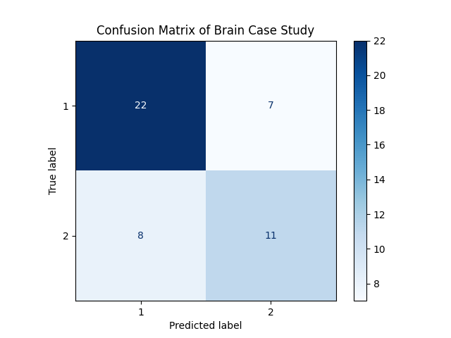

# 🧠 Head Size and Brain Weight Gender Prediction using Decision Tree

A Machine Learning case study that predicts the **Gender** of a person based on **Age Range**, **Head Size**, and **Brain Weight** using the **Decision Tree Classification Algorithm**.

This project demonstrates a complete supervised Machine Learning workflow including data analysis, model training, evaluation, model persistence, and prediction.

---

## 📌 Project Overview

This project performs the following tasks:

- Load the Head Brain dataset
- Analyze the dataset
- Check missing values
- Generate statistical summary
- Calculate feature correlation
- Split the dataset into training and testing sets
- Train a Decision Tree Classifier
- Predict Gender
- Evaluate model performance
- Display Confusion Matrix
- Save the trained model
- Load the saved model
- Predict a sample record
- Export prediction results to a CSV file

---

## 📂 Project Structure

```text
HEAD BRAIN GENDER PREDICTION
│
├── HeadBrain.py
├── HeadBrain.csv
├── HeadBrain_Output.csv
├── HeadBrain_DT_Model.joblib
├── Confusion_Matrix.png
├── README.md
└── requirements.txt
```

---

## 🛠 Technologies Used

- Python 3.x
- Pandas
- NumPy
- Matplotlib
- Scikit-learn
- Joblib

---

## 📦 Required Libraries

Install all required libraries using:

```bash
pip install -r requirements.txt
```

or

```bash
pip install pandas numpy matplotlib scikit-learn joblib
```

---

## ▶️ How to Run

Clone the repository

```bash
git clone https://github.com/yogikh2005/ML_Case_Study.git
```

Go to the project folder

```bash
cd ML_Case_Study
```

Run the application

```bash
python HeadBrain.py
```

---

## 📊 Dataset

The project uses the **HeadBrain.csv** dataset.

The dataset contains physical measurements that are used to predict the gender of an individual.

---

## 📄 Dataset Features

| Feature | Description |
|----------|-------------|
| Age Range | Age category of the person |
| Head Size(cm^3) | Head size measured in cubic centimeters |
| Brain Weight(grams) | Brain weight measured in grams |

### 🎯 Target Variable

| Target | Description |
|--------|-------------|
| Gender | Male / Female |

---

## ⚙️ Machine Learning Workflow

1. Load Dataset
2. Analyze Dataset
3. Check Missing Values
4. Generate Statistical Summary
5. Calculate Correlation Matrix
6. Split Dataset
7. Train Decision Tree Model
8. Predict Gender
9. Evaluate Model
10. Display Confusion Matrix
11. Save Model using Joblib
12. Load Saved Model
13. Predict Sample Record
14. Export Predictions to CSV

---

## 🤖 Model Details

### Algorithm

- Decision Tree Classifier

### Model Parameters

```python
DecisionTreeClassifier(
    criterion="gini",
    max_depth=5,
    random_state=42
)
```

---

## 📈 Model Evaluation

The model is evaluated using:

- Accuracy Score
- Confusion Matrix

---

## 📷 Output

### Confusion Matrix

<p align="center">
  
</p>

---

## 💾 Output Files

### Trained Model

```text
HeadBrain_DT_Model.joblib
```

### Prediction Output

```text
HeadBrain_Output.csv
```

---

## 📁 Generated Files

After successful execution, the following files are generated:

- HeadBrain_Output.csv
- HeadBrain_DT_Model.joblib

---

## 📚 Concepts Covered

- Supervised Machine Learning
- Decision Tree Classification
- Data Analysis
- Correlation Matrix
- Train-Test Split
- Model Evaluation
- Accuracy Score
- Confusion Matrix
- Model Persistence using Joblib
- Gender Prediction

---

## 🚀 Future Improvements

- Hyperparameter Tuning
- Cross Validation
- Feature Importance Visualization
- Random Forest Classifier
- Gradient Boosting
- XGBoost
- Flask REST API
- Streamlit Web Application

---

## 👨‍💻 Author

**Yogiraj Khaladkar**

Engineering Student | Machine Learning Developer

---

## ⭐ Repository

If you found this project useful, please consider giving it a ⭐ on GitHub.