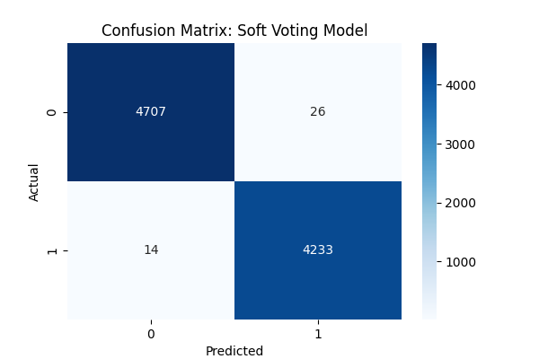

# 📰 Fake News Detection using Voting Classifier

A Machine Learning case study that classifies news articles as **Fake** or **True** using an **Ensemble Voting Classifier**.

The project combines **Logistic Regression** and **Decision Tree** classifiers with both **Soft Voting** and **Hard Voting** strategies. News articles are converted into numerical features using **TF-IDF Vectorization** before training the models.

---

## 📌 Project Overview

This project demonstrates a complete Natural Language Processing (NLP) and Machine Learning pipeline for Fake News Detection.

The application performs the following tasks:

- Load Fake and True news datasets
- Merge both datasets
- Perform data preprocessing
- Generate dataset statistics
- Visualize class distribution
- Extract text features using TF-IDF
- Split dataset into training and testing sets
- Train Soft Voting and Hard Voting classifiers
- Evaluate model performance
- Display Confusion Matrices
- Save trained models and TF-IDF vectorizer
- Export prediction results to a CSV file

---

## 📂 Project Structure

```
FAKE NEWS DETECTION
│
├── Fake_News_Detection.py
├── Fake.csv
├── True.csv
├── FakeNews_Output.csv
├── FakeNews_SoftVoting.joblib
├── FakeNews_HardVoting.joblib
├── FakeNews_Tfidf.joblib
├── Confusion_Matrix_Soft_Voting.png
├── Confusion_Matrix_Hard_Voting.png
├── README.md
└── requirements.txt
```

---

## 🛠 Technologies Used

- Python 3.x
- Pandas
- Matplotlib
- Seaborn
- Scikit-learn
- Joblib

---

## 📦 Required Libraries

Install all required libraries using:

```bash
pip install -r requirements.txt
```

or

```bash
pip install pandas matplotlib seaborn scikit-learn joblib
```

---

## ▶️ How to Run

Clone the repository

```bash
git clone https://github.com/yogikh2005/ML_Case_Study.git
```

Go to the project folder

```bash
cd ML_Case_Study
```

Run the application

```bash
python Fake_News_Detection.py
```

---

## 📊 Dataset

The project uses two datasets.

### Fake.csv

Contains fake news articles.

### True.csv

Contains genuine news articles.

---

## 📄 Dataset Features

| Feature | Description |
|----------|-------------|
| title | News headline |
| text | News article |
| subject | News category |
| date | Publication date |

---

## 🎯 Target Variable

| Label | Meaning |
|-------|---------|
| 0 | Fake News |
| 1 | True News |

---

## ⚙️ Machine Learning Workflow

1. Load Fake & True datasets
2. Merge datasets
3. Assign class labels
4. Remove unnecessary columns
5. Combine title and text
6. Perform Dataset Analysis
7. Split dataset
8. Convert text using TF-IDF
9. Train Logistic Regression
10. Train Decision Tree
11. Build Soft Voting Classifier
12. Build Hard Voting Classifier
13. Evaluate both models
14. Display Confusion Matrices
15. Save trained models
16. Save TF-IDF vectorizer
17. Export predictions to CSV

---

## 🤖 Models Used

### Base Models

- Logistic Regression
- Decision Tree Classifier

### Ensemble Models

- Soft Voting Classifier
- Hard Voting Classifier

### Feature Extraction

- TF-IDF Vectorizer

---

## 📈 Model Evaluation

The models are evaluated using:

- Accuracy Score
- Classification Report
- Confusion Matrix

---

## 💾 Output Files

### Soft Voting Model

```
FakeNews_SoftVoting.joblib
```

### Hard Voting Model

```
FakeNews_HardVoting.joblib
```

### TF-IDF Vectorizer

```
FakeNews_Tfidf.joblib
```

### Prediction Output

```
FakeNews_Output.csv
```

---

## 📷 Output Images

The project generates the following confusion matrix visualizations.

### Soft Voting Confusion Matrix

<p align="center">
  
</p>

### Hard Voting Confusion Matrix

<p align="center">
  
</p>

---

## 📚 Concepts Covered

- Natural Language Processing (NLP)
- Text Classification
- TF-IDF Vectorization
- Logistic Regression
- Decision Tree
- Ensemble Learning
- Voting Classifier
- Soft Voting
- Hard Voting
- Model Evaluation
- Confusion Matrix
- Joblib Model Persistence

---

## 🚀 Future Improvements

- Random Forest Classifier
- XGBoost Classifier
- Naive Bayes
- Support Vector Machine (SVM)
- Deep Learning (LSTM)
- Transformer Models (BERT)
- Streamlit Web Application
- Flask REST API

---

## 👨‍💻 Author

**Yogiraj Khaladkar**

Engineering Student | Machine Learning Developer

---

## ⭐ Repository

If you found this project useful, please consider giving it a ⭐ on GitHub.