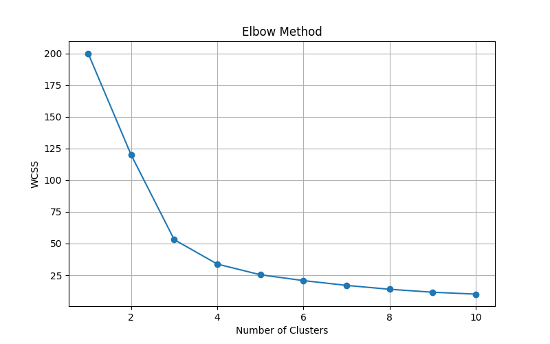

# 🛍️ Mall Customer Segmentation using K-Means Clustering

A Machine Learning project that performs **Customer Segmentation** using the **K-Means Clustering Algorithm**. The project groups mall customers based on their **Annual Income** and **Spending Score**, helping businesses identify different customer segments for targeted marketing.

---

## 📌 Project Overview

Customer segmentation is one of the most common applications of **Unsupervised Machine Learning**. This project uses the **K-Means Clustering** algorithm to divide customers into different groups based on similar purchasing behavior.

The project includes:

- Data preprocessing
- Feature scaling using `StandardScaler`
- Finding the optimal number of clusters using the **Elbow Method**
- Training the K-Means model
- Predicting customer clusters
- Saving the trained model and scaler using Joblib
- Exporting clustered data to a CSV file

---

## 📂 Project Structure

```
Mall Customer Segmentation/
│
├── Mall_Customers.csv
├── Final_Mall_Customers_Predictions.csv
├── Mall_Customer_Kmean.py
├── Mall_Customers.joblib
├── Mall_Customers_Scaler.joblib
├── Elbow_Method_Output.png
├── requirements.txt
└── README.md
```

---

## 🛠️ Technologies Used

- Python
- Pandas
- Matplotlib
- Scikit-Learn
- Joblib

---

## 📊 Dataset

Dataset contains customer information such as:

- Customer ID
- Gender
- Age
- Annual Income
- Spending Score

For clustering, the following features are used:

- **Annual Income**
- **Spending Score**

---

## ⚙️ Machine Learning Workflow

### Step 1
Load Dataset

### Step 2
Perform Dataset Analysis

- Shape
- Columns
- Missing Values
- Statistical Summary

### Step 3
Scale Features

The dataset is normalized using **StandardScaler**.

### Step 4
Find Optimal Number of Clusters

The **Elbow Method** is used to determine the optimal value of **K**.

### Step 5
Train K-Means Model

The K-Means model is trained with:

- Number of Clusters = 4
- Random State = 42

### Step 6
Predict Customer Clusters

Each customer is assigned to a cluster.

### Step 7
Save Model

The trained model is saved using Joblib.

### Step 8
Load Model

The saved model and scaler are loaded to predict new customer data.

### Step 9
Save Final Output

Cluster labels are stored in:

```
Final_Mall_Customers_Predictions.csv
```

---

# 📈 Elbow Method Output

The Elbow Method helps determine the optimal number of clusters.

```markdown

```

---

## 🚀 How to Run

### Clone Repository

```bash
git clone https://github.com/yogikh2005/ML_Case_Study.git
```

### Install Required Packages

```bash
pip install -r requirements.txt
```

### Run Project

```bash
python Mall_Customer_Kmean.py
```

---

## 📄 Output Files

After execution, the following files are generated:

| File | Description |
|------|-------------|
| Mall_Customers.joblib | Trained K-Means Model |
| Mall_Customers_Scaler.joblib | Saved StandardScaler |
| Final_Mall_Customers_Predictions.csv | Customer clusters |
| Elbow_Method_Output.png | Elbow Method graph |

---

## 📷 Sample Prediction

Example:

```
New Customer

Annual Income : 65
Spending Score : 40

Predicted Cluster : 2
```

---

## 📚 Libraries Used

```
pandas
matplotlib
scikit-learn
joblib
```

---

## 🎯 Applications

- Customer Segmentation
- Marketing Strategy
- Personalized Offers
- Customer Behaviour Analysis
- Retail Analytics

---

## 👨‍💻 Author

**Yogiraj Khaladkar**

Computer Engineering Student | Machine Learning Developers | Java Developer 

---

## ⭐ If you found this project helpful, consider giving it a Star on GitHub!