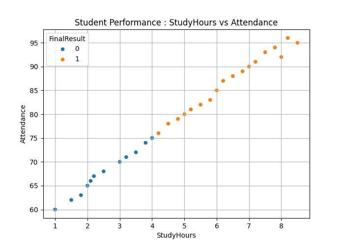

# 🎓 Student Performance Prediction using Decision Tree

A Machine Learning case study that predicts a student's **Final Result** based on academic performance factors such as study hours, attendance, previous score, assignments completed, and sleep hours.

This project is implemented using **Python**, **Scikit-learn**, **Pandas**, **Matplotlib**, and **Seaborn**.

---

## 📌 Project Overview

This project demonstrates a complete Machine Learning workflow using the **Decision Tree Classification Algorithm**.

The application performs the following tasks:

- Load student performance dataset
- Display dataset statistics
- Perform data visualization
- Split dataset into training and testing sets
- Train a Decision Tree Classifier
- Predict student results
- Evaluate model performance
- Display Confusion Matrix
- Save trained model using Joblib
- Load saved model for prediction
- Export prediction results to CSV

---

## 📂 Project Structure

```
STUDENT PERFORMANCE CASE STUDY
│
├── student_performance.py               # Main source code
├── student_performance_ml.csv           # Input Dataset
├── student_performance_ml_Output.csv    # Prediction Output
├── student_performance_ml.joblib        # Saved ML Model
├── Student_Performance.png              # Output Screenshot
├── Requirements.txt
└── README.md
```

---

## 🛠 Technologies Used

- Python 3.x
- Pandas
- Matplotlib
- Seaborn
- Scikit-learn
- Joblib

---

## 📦 Required Libraries

Install all required packages using:

```bash
pip install pandas matplotlib seaborn scikit-learn joblib
```

or

```bash
pip install -r requirements.txt
```

---

## ▶️ How to Run

Clone the repository

```bash
git clone https://github.com/yogikh2005/ML_Case_Study.git
```

Go to project folder

```bash
cd STUDENT PERFORMANCE CASE STUDY
```

Run the project

```bash
python student_performance.py
```

---

## 📊 Input Features

The model uses the following features:

| Feature | Description |
|----------|-------------|
| StudyHours | Number of study hours |
| Attendance | Attendance percentage |
| PreviousScore | Previous exam marks |
| AssignmentsCompleted | Number of assignments completed |
| SleepHours | Daily sleeping hours |

### Target Variable

```
FinalResult
```

Example:

- Pass
- Fail

---

## ⚙️ Machine Learning Workflow

1. Load Dataset
2. Display Dataset Statistics
3. Select Features & Target
4. Split Dataset
5. Train Decision Tree Model
6. Make Predictions
7. Evaluate Accuracy
8. Plot Confusion Matrix
9. Save Model
10. Load Saved Model
11. Export Prediction Results

---

## 📈 Evaluation Metrics

The project evaluates the model using:

- Accuracy Score
- Confusion Matrix
- Classification Report

---

## 💾 Output Files

### Trained Model

```
student_performance_ml.joblib
```

### Prediction Output

```
student_performance_ml_Output.csv
```
---

## 📊 Data Visualization

The dataset is visualized using a scatter plot to understand the relationship between **Study Hours** and **Attendance**.

- **X-axis:** Study Hours
- **Y-axis:** Attendance (%)
- **Color Encoding:** Final Result (Pass/Fail)
- **Purpose:** Helps visualize how study hours and attendance influence student performance.

### Student Performance Visualization

<p align="center">
  
</p>

**Observation:**

- 🟢 Students with higher study hours and better attendance are more likely to pass.
- 🔴 Students with lower study hours and poor attendance are more likely to fail.
- The scatter plot clearly shows the relationship between academic effort and final performance.

---

## 📷 Output

Example outputs include:

- Dataset Information
- Scatter Plot
- Confusion Matrix
- Accuracy
- Classification Report
- Prediction CSV

---

## 🧠 Decision Tree Parameters

```python
DecisionTreeClassifier(
    criterion="gini",
    max_depth=2,
    random_state=42
)
```

---

## 📚 Concepts Covered

- Data Preprocessing
- Data Visualization
- Train-Test Split
- Decision Tree Classification
- Model Evaluation
- Model Serialization
- Prediction
- CSV Export

---

## 🚀 Future Improvements

- Hyperparameter Tuning
- GridSearchCV
- Random Forest Classifier
- XGBoost Classifier
- Feature Importance Visualization
- Cross Validation
- Flask API Deployment

---

## 👨‍💻 Author

**Yogiraj Khaladkar**

Engineering Student | Machine Learning Developer 

---

## ⭐ Repository

If you found this project useful, don't forget to ⭐ the repository.