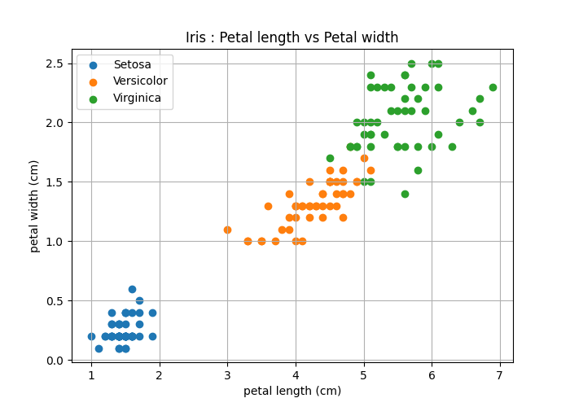
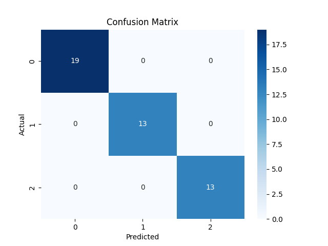

# 🌸 Iris Flower Classification using Decision Tree

A Machine Learning case study that classifies Iris flowers into different species using the **Decision Tree Classification Algorithm** from Scikit-Learn.

This project demonstrates the complete Machine Learning pipeline including:

- Dataset Loading
- Data Analysis
- Data Visualization
- Dataset Splitting
- Model Training
- Model Evaluation
- Confusion Matrix Visualization
- Model Saving & Loading
- Prediction Result Export

---

## 📂 Project Structure

```
IRIS CASE STUDY/
│
├── iris.py                    # Main Python program
├── iris.csv                   # Input dataset
├── iris-Output.csv            # Prediction results
├── iris.joblib                # Saved Decision Tree model
├── Confusion_Matrix.png       # Confusion Matrix Heatmap
├── Petal_len_VS_Petal_width.png # Scatter plot visualization
├── requirements.txt           # Project Requirements
└── README.md                  # Project documentation
```

---

## 📊 Dataset

The project uses the famous **Iris Flower Dataset**.

### Features

- Sepal Length
- Sepal Width
- Petal Length
- Petal Width

### Target

- variety

Possible classes:

- Setosa
- Versicolor
- Virginica

---

## 🚀 Machine Learning Workflow

```
Load Dataset
      │
      ▼
Dataset Statistics
      │
      ▼
Data Visualization
      │
      ▼
Feature & Target Selection
      │
      ▼
Train/Test Split
      │
      ▼
Decision Tree Training
      │
      ▼
Prediction
      │
      ▼
Performance Evaluation
      │
      ▼
Confusion Matrix
      │
      ▼
Save Model
      │
      ▼
Load Model
      │
      ▼
Export Predictions
```
---

## 📊 Visualizations

### Petal Length vs Petal Width

This scatter plot shows the distribution of Iris flower species based on petal length and petal width.



---

### Confusion Matrix

The confusion matrix visualizes the performance of the Decision Tree classifier.



---

## 📦 Required Python Packages

Install dependencies using pip.

```bash
pip install pandas matplotlib seaborn scikit-learn joblib
```

or

```bash
pip install -r requirements.txt
```

---

## ▶️ How to Run

Clone the repository

```bash
git clone https://github.com/yogikh2005/ML_Case_Study.git
```

Move into the project folder

```bash
cd ML_Case_Study
```

Run the application

```bash
python main.py
```

---

## 📈 Model Used

**Decision Tree Classifier**

Parameters used:

```python
DecisionTreeClassifier(
    criterion="gini",
    max_depth=5,
    random_state=42
)
```

---

## 📊 Output

The application displays:

- Dataset Information
- Dataset Shape
- Column Names
- Statistical Summary
- Missing Values
- Scatter Plot
- Training Accuracy
- Testing Accuracy
- Classification Report
- Confusion Matrix

It also generates:

- `iris.joblib`
- `iris-Output.csv`

---

## 💾 Model Persistence

The trained model is stored using **Joblib**.

```python
joblib.dump(model, "iris.joblib")
```

The model can later be loaded using

```python
joblib.load("iris.joblib")
```

---

## 📝 Functions Included

| Function | Description |
|----------|-------------|
| display_Info() | Display formatted title |
| dataset_statistics() | Dataset analysis |
| split_dataset() | Train/Test split |
| train_model() | Train Decision Tree |
| plot_heatmap() | Confusion Matrix Heatmap |
| save_model() | Save trained model |
| load_model() | Load saved model |
| save_csv() | Export prediction results |
| main() | Complete ML pipeline |

---

## 📚 Technologies Used

- Python
- Pandas
- NumPy
- Matplotlib
- Seaborn
- Scikit-Learn
- Joblib

---

## 📌 Machine Learning Concepts Covered

- Supervised Learning
- Classification
- Decision Trees
- Train-Test Split
- Model Evaluation
- Accuracy Score
- Confusion Matrix
- Classification Report
- Model Serialization

---

## 🎯 Learning Objectives

This project is suitable for students learning:

- Machine Learning
- Data Analysis
- Data Visualization
- Scikit-Learn
- Python Programming

It is also useful for interview preparation and academic mini-projects.

---

## 👨‍💻 Author

**Yogiraj Khaladkar**

Computer Engineering Student | Machine Learning Developer | Java Developer

---

## ⭐ Repository

If you found this project useful, consider giving it a ⭐ on GitHub.

Happy Coding! 🚀